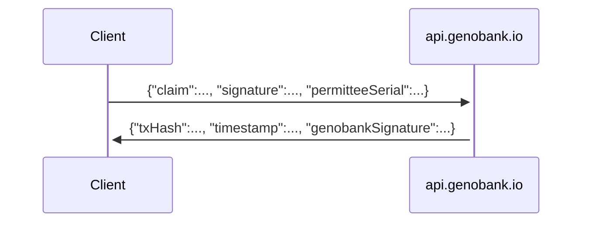

# :warning: This is an alpha-quality, technology preview :warning:

---

# GenoBank.io Dot Net

A C# client for the GenoBank.io platform 🧬



## Prerequisites

1. Supported operating systems are macOS, Linux and Windows

2. [Install .NET SDK](https://docs.microsoft.com/en-us/dotnet/core/install/)
   1. :information_source: This project has been tested on macOS Big Sur / Apple Silicon / .NET SDK (5.0.201)

## Downloading

Get the latest source code from GitHub:

```sh
mkdir -p ~/Developer
cd ~/Developer
git clone https://github.com/Genobank/genobankio-dot-net.git
cd genobankio-dot-net
```

## Building and testing

Install dependencies:

```sh
dotnet restore
```

Run the product without arguments to see instructions:

```sh
dotnet run
```

Or include all required parameters to notarize a certificate:

```sh
dotnet run --test 'candy maple cake sugar pudding cream honey rich smooth crumble sweet treat' 1 'NAME' 'PASSPORT123' '1' 'N' '' 1611517330
```

## Overview

- `LaboratoryProcedure`, `LaboratoryProcedureResult`, `Network` are simple records.
- `PermitteeRepresentations` stores everything that the permittee (laboratory) will attest to.
- `PermitteeSigner` performs cryptographic signing on behalf of the permittee.
- `Platform` notarizes the certificate onto the blockchain using GenoBank.io.
- `NotarizedCertificate` is the notarized artifact.
- `Main` is the program entry point.

## Extending

You are welcome to extend the functionality of this example, for example to connect to an ERP system or add additional information (like birthday) into the name field.

## References

* Project setup
  * Git ignore file: https://gist.github.com/kmorcinek/2710267
  * Initializing a new C# project https://dotnet.microsoft.com/learn/dotnet/hello-world-tutorial/install
* Coding style
  * Basic style for C#: https://docs.microsoft.com/en-us/dotnet/csharp/programming-guide/inside-a-program/coding-conventions

