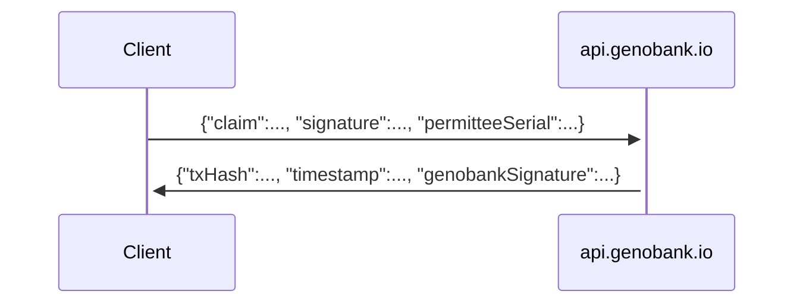

# :warning: This is a beta-quality, tech preview :warning:

---

# GenoBank.io Dot Net

A C# client for the GenoBank.io platform 🧬



## Prerequisites

1. Supported operating systems are macOS, Linux and Windows

2. [Install .NET SDK](https://docs.microsoft.com/en-us/dotnet/core/install/)
   1. :information_source: This project has been tested on macOS Big Sur / Apple Silicon / .NET SDK (5.0.201)

## Downloading

Get the latest source code from GitHub:

```sh
mkdir -p ~/Developer
cd ~/Developer
git clone https://github.com/Genobank/genobankio-dot-net.git
cd genobankio-dot-net
```

## Building and testing

Install dependencies:

```sh
dotnet restore
```

Run the product without arguments to see instructions:

```sh
dotnet run
```

Or include all required parameters to notarize a certificate:

```sh
dotnet run --test 'candy maple cake sugar pudding cream honey rich smooth crumble sweet treat' 1 'NAME' 'PASSPORT123' '1' 'N' '' 1611517330
```

## Overview

- `LaboratoryProcedure`, `LaboratoryProcedureResult`, `Network` are simple records.
- `PermitteeRepresentations` stores everything that the permittee (laboratory) will attest to.
- `PermitteeSigner` performs cryptographic signing on behalf of the permittee.
- `Platform` notarizes the certificate onto the blockchain using GenoBank.io.
- `NotarizedCertificate` is the notarized artifact.
- `Main` is the program entry point.

## Extending

You are welcome to extend the functionality of this example, for example to connect to an ERP system or add additional information (like birthday) into the name field.

## References

* Project setup
  * Git ignore file: https://gist.github.com/kmorcinek/2710267
  * Initializing a new C# project https://dotnet.microsoft.com/learn/dotnet/hello-world-tutorial/install
* Coding style
  * Basic style for C#: https://docs.microsoft.com/en-us/dotnet/csharp/programming-guide/inside-a-program/coding-conventions

# Medicomet / Pasteur C-Sharp Implementation

Need:

* HD Wallet
* SHA3
* Ethereum message prefix and signing

C Sharp possible packages

* https://github.com/Nethereum/Nethereum
  * HD Wallet
    * This might work http://playground.nethereum.com/csharp/id/1043
  * How to complie // https://stackoverflow.com/questions/49925484/you-must-add-a-reference-to-assembly-netstandard-version-2-0-0-0 “You must add a reference to assembly”
  * Getting support / https://github.com/Nethereum/Nethereum/issues/667
  * Other support / https://discord.com/channels/765580668327034880/770613045827207168/823414319727116308


Dot Net 101

* MSFT hello world 

* How to add a package / https://stackoverflow.com/questions/43378596/installing-package-with-nuget-in-net-core-on-mac

… 

...

# Log

- :white_check_mark: Created console app / https://dotnet.microsoft.com/learn/dotnet/hello-world-tutorial/install
- :white_check_mark: run Nethereum example / https://nethereum.readthedocs.io/en/latest/getting-started/
  - Do NOT use VS Code popup for adding build/test stuff
- :white_check_mark: Try parts we need for Web3
  - Need `NBitcoin`
  - http://playground.nethereum.com/csharp/id/1043
  - Need `❯ dotnet add package Nethereum.HdWallet     `
    - Saw this because https://github.com/bethanyuo/nethereum-wallet/blob/89f2e15c4d90986875535a6afb7eeb2c82822bd0/README.md shows it as a separate dependency

* :white_check_mark: Add parts for JSON REST client
  * https://docs.microsoft.com/en-us/dotnet/csharp/tutorials/console-webapiclient
